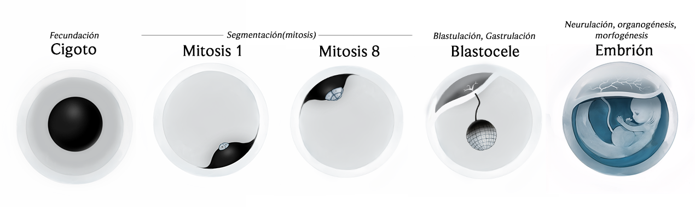

piel: Nanomateriales: Los nanomateriales, como los nanotubos de carbono y el grafeno, tienen propiedades aislantes excepcionales y podrían ser utilizados en capas finas bajo la dermis de las sirenas.
Capas diferenciadas: Las sirenas podrían tener una dermis compuesta por varias capas, con una capa interna que contiene una mayor concentración de nanomateriales para el aislamiento térmico y una capa externa más similar a la piel humana para mantener la textura y suavidad.
Patrones específicos: Los nanomateriales podrían distribuirse en la dermis en patrones específicos que imitan la estructura de la piel humana, minimizando su impacto visible y sensorial.
Activación selectiva: Las sirenas podrían tener un mecanismo de activación selectiva para los nanomateriales, controlando cuándo y dónde se liberan en la dermis, optimizando el aislamiento térmico sin afectar permanentemente la textura y suavidad.
el colágeno y elastina

Glicerina: La glicerina es un líquido viscoso y transparente con propiedades aislantes superiores a la grasa. Se utiliza en diversas aplicaciones, como la fabricación de anticongelantes y cosméticos.

Fluidos supercríticos: Estos fluidos, como el CO2 supercrítico, tienen propiedades de aislamiento térmico únicas y podrían ser utilizados por las sirenas en un sistema circulatorio especializado

segmentación holoblastica=total
- igual -> humana -> oligolecitos-{isolecito/homolecito}
- desigual(bilateral) -> anfibios -> {mesolecitos, anisolecitos/heterolecitos->telolecitos}

segmentación meroblastica=parcial -> polilecíticos -> {anisolecitos/heterolecitos->telolecitos}
- discoidal -> tiburones, pulpos 

La *morfología* de las sirenas, desde su estructura ósea y cartilaginosa hasta la forma de sus aletas, será examinada con detalle. Se discutirá cómo podrían haber evolucionado para nadar con gracia y eficiencia en las profundidades marinas. Además, se analizará la estructura de su piel y escamas, considerando posibles adaptaciones a la presión y temperatura del agua. ¿Podrían tener una *epidermis* como la de los humanoso con una textura más parecida a la de los delfines? ¿Cómo sería la textura y composición de sus escamas al tacto?

Se analizarán los *sistemas* biológicos clave de las sirenas, incluyendo su aparato reproductor, respiratorio y mecanismos de termorregulación. ¿Cómo podrían haber adaptado estos sistemas para vivir tanto en aguas profundas como cerca de la superficie? En el caso del sistema respiratorio, se examinará la posibilidad de que posean branquias y pulmones, permitiéndoles respirar tanto bajo el agua como en la superficie. ¿Qué tipo de sistema circulatorio podrían tener para soportar las extremas presiones del océano profundo?

En términos de *reproducción*, se considerarán varias hipótesis: ¿Son vivíparas como los mamíferos marinos, ovíparas como muchos peces, o tal vez algo intermedio? Se especulará sobre sus rituales de apareamiento y cómo podrían haber desarrollado estrategias reproductivas únicas para garantizar la supervivencia de sus crías en un entorno tan desafiante.

Finalmente, se explorará su comportamiento *social* y capacidades cognitivas. ¿Podrían las sirenas tener una estructura social compleja similar a la de los delfines, con jerarquías y roles definidos dentro de sus comunidades? ¿Qué tipo de lenguaje o métodos de comunicación utilizarían? Este proyecto también considerará sus posibles interacciones con humanos a lo largo de la historia, especulando sobre cómo estas criaturas podrían haber influido en nuestra cultura y folklore.

Se abarcará su morfología, sistemas biológicos, reproducción y comportamiento social, analizando cómo estos seres mitológicos podrían haberse adaptado a la vida marina, considerando aspectos como su estructura ósea, piel, sistemas respiratorio y circulatorio, métodos de reproducción y capacidades cognitivas. También se especula sobre sus posibles interacciones con humanos y su influencia en la cultura y el folklore.

## Ovoviviparismo ovisacárido

Los huevos de los Sirenis sapiens son una variante evolutiva anamniota con características particulares. Aunque carecen de membranas extraembrionarias especializadas como las de los amniotas terrestres, los embriones están conectados al exterior de la membrana por un tubo similar al tubo vitelino de otros animales. Este tubo absorbe nutrientes del líquido amniótico dentro del vientre del sireno o sirena, asegurando el desarrollo adecuado de los embriones antes del desove y su posterior eclosión.

La cáscara gelatinosa y serosa de los huevos bentónicos es secretada por una glándula nidamentaria, comparable a las velas presentes en otros animales marinos. Esta estructura protege y sostiene los huevos durante el desarrollo intrauterino y en las etapas iniciales del desarrollo larval, fuera del útero, posterior a la eclosión.

Esta especie de sirenas son ovovivíparos, lo que implica que la fecundación ocurre internamente y los huevos se desarrollan dentro del cuerpo de la madre o padre, aunque con el caso particular de que los huevos no eclosionan dentro del útero, sino que se preoduce un desove días antes de que eclosionen. Los cigotos son *mesolecitos* con segmentación *holoblástica desigual*.

## Fecundación y segmentación
1. *Fecundación y desarrollo inicial*: La fecundación de los huevos de sirena ocurre internamente, dentro del útero. El cigoto, con *disposición mesotelolecítica*, se adhiere a las paredes internas del huevo, que son firmes y gelatinosas. Inicia la segmentación, donde el cigoto comienza a dividirse en células más pequeñas mientras el huevo flota en el útero.
2. *segmentación holoblástica desigual*: .

## Blastulación y Gastrulación
1. *Morula*: En este punto se hacen distinguibles los micrómeros y los macrómeros.
2. *Blastulación*: La mórula se transforma en una blástula, una esfera hueca compuesta por una capa externa de células denominada *trofoblasto*/*blastodermo*. A medida que la blastulación progresa, se empiezan a diferenciar dos capas principales: la *embrioblasto*/*epiblasto*, que formará los tejidos del embrión, y el *trofoblasto*/*hipoblasto*, que contribuirá a la formación de estructuras adicionales como el saco vitelino/placenta. En este punto, se empieza a formar una estructura más compleja que preparará el camino para la gastrulación.

## Desarrollo embrionario
5. *Gastrulación*: Durante la gastrulación, las células del epiblasto se reorganizan para formar tres capas germinales: el ectodermo, el mesodermo y el endodermo. Este proceso se inicia con la formación de una hendidura llamada línea primitiva en el polo posterior del embrión. A medida que las células migran hacia esta línea, se generan dos pliegues laterales que convergen en la línea media, formando una estructura llamada notocorda. La notocorda proporciona soporte y guía el desarrollo de la columna vertebral. Las capas germinales se diferenciarán en los tejidos y órganos del embrión, con el ectodermo dando lugar al sistema nervioso y la piel, el mesodermo formando músculos y huesos, y el endodermo desarrollando el sistema digestivo y respiratorio.
6. *Neurulación*: La neurulación es el proceso mediante el cual se forma el sistema nervioso central. Durante esta fase, el ectodermo sobre la notocorda se pliega para formar un tubo neural. Este tubo eventualmente se cerrará y se desarrollará en el cerebro y la médula espinal. La neurulación también implica la formación de las placas y los surcos neurales, que luego se transforman en estructuras más complejas del sistema nervioso. En el caso de las sirenas, el tubo neural comenzará a adquirir características específicas relacionadas con su capacidad para vivir en el medio acuático.
7. *Organogénesis*: La organogénesis es el proceso en el que se desarrollan y organizan los órganos y sistemas del cuerpo del embrión. Durante esta etapa, las capas germinales se diferencian en órganos específicos. En las sirenas, esto incluirá la formación de estructuras típicas de los vertebrados, como el corazón, los pulmones modificados para respirar bajo el agua, y el sistema digestivo adaptado a una dieta marina. Además, se desarrollarán las estructuras características de las sirenas, como las aletas y la cola, que serán cruciales para su vida en el océano.
8. *Morfogénesis*: La morfogénesis es el proceso que da forma a los órganos y estructuras corporales del embrión. Durante esta fase, las células se organizan en patrones específicos y adoptan formas particulares para formar los tejidos y órganos del cuerpo. En las sirenas, la morfogénesis incluye la modelación de la cola y las aletas, la configuración de los rasgos faciales distintivos, y la integración de sistemas biológicos como el sistema circulatorio y el sistema nervioso en un diseño armónico y funcional para la vida marina.

## Procesos durante el desarrollo
7. *Desarrollo intrauterino*: Durante un período de tiempo variable, los huevos se desarrollan dentro del cuerpo del sireno, recibiendo nutrientes del líquido amniótico que permea en el huevo cuando el vitelio del saco se agota por completo.
8. *Expulsión y desarrollo externo*: Cuando el desarrollo intrauterino ha avanzado lo suficiente, los huevos son expulsados al mar. Aquí continúan su desarrollo hasta eclosionar en un estado larval parecido al de los anfibios.
9.  *Metamorfosis*: Después de la eclosión, las larvas experimentan una metamorfosis que les confiere rasgos más `"humanos"` pero manteniendo características que los hacen distintivos.

Pleiotropía, Vestigio evolutivo y un gen pleiotrópico para la formación de un ombligo.

animal -> ectodermo
vegetal -> endodermo
interior blastocele -> mesodermo

gastrulación: se forma el blastoporo por invaginaciñon y se alarga creando el archenteron

saco vitelino interno

1. Gastrulación: Se forma el arquéntero, una cavidad que se convierte en el intestino primitivo. La línea/estría primitiva marca el lugar donde las células comienzan a invaginarse para formar tres capas germinativas. El plug de vitelo es una parte de la capa externa que aún contiene vitelo no utilizado. El blastocelo se reabsorbe a medida que se forman las nuevas capas.
2. Desarrollo de las membranas extraembrionarias: amnios, línea/estría primitiva, placa precordal
3. Neurulación: placa neural, tubo neural