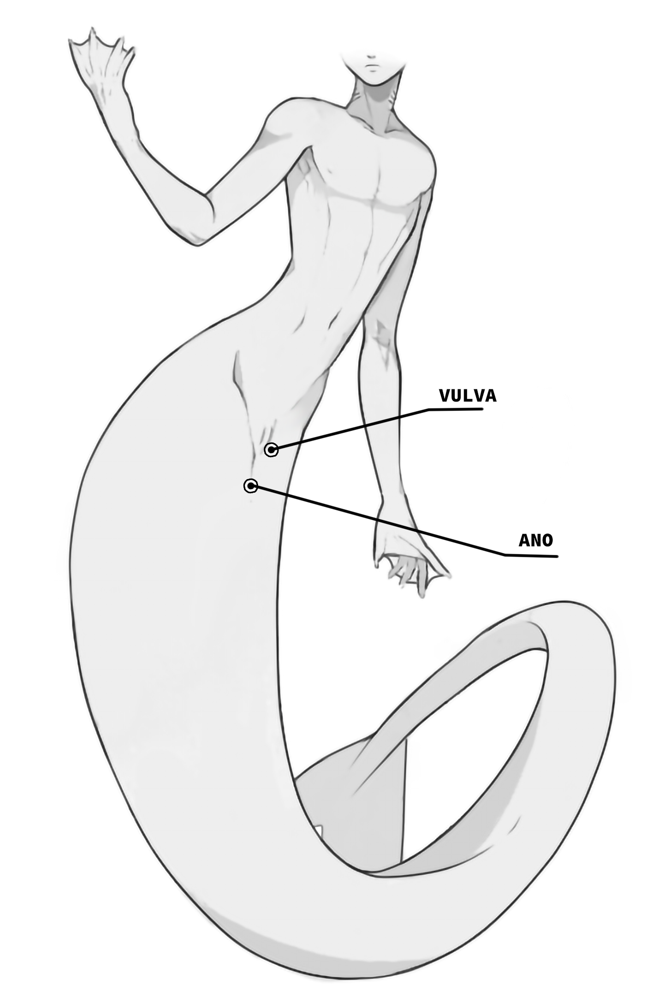
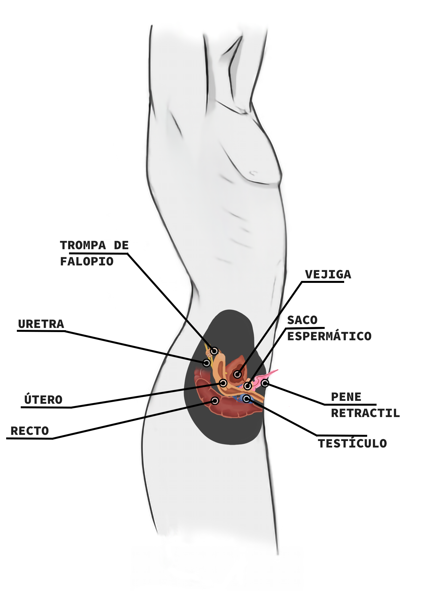

Al igual que en la mayoría de las especies, las sirenas y sirenos presentan una serie de diferencias en aparato reproductor, según el sexo. 

Mientras que las sirenas son monosexuales, equipadas únicamente con órganos reproductores femeninos, los sirenos poseen hermafroditismo simultáneo desde el nacimiento hasta la vida adulta, poseyendo órganos reproductores funcionales de ambos sexos en todo momento. 

Esto difiere de otras especies como el sargo y la anguila, que pueden cambiar de sexo durante su vida. Sin embargo, aunque los sirenos masculonos tienen ambos tipos de órganos reproductores, no tienen la capacidad de autofecundarse.

El sistema reproductor externo de la especie presenta marcadas diferencias entre sirenos y sirenas, reflejando adaptaciones específicas a sus roles reproductivos. Ambos géneros presentan una estructura vulvar que facilita el acceso al cuello uterino.

Como ya se dijo, en contraste con la especialización reproductiva de las sirenas, los sirenos exhiben una adaptación hermafrodita que les permite mantener órganos reproductores funcionales de ambos sexos a lo largo de su vida. 

Esta dualidad biológica no solo se refleja en su morfología externa, con terminaciones específicas como la uretra distal o la entrada vaginal, sino también en las complejas conexiones internas que permiten el proceso reproductivo. A continuación se describen cada una de estas terminaciones en cada caso, en orden vertical de arriba hacia abajo.

## Zona genital en el caso de las sirenas

El caso de las sirenas es casi idéntico del de las mujeres en la especie humana:

- *El glande del clítoris*, que se extiende internamente hasta el pilar del clítoris o cuerpo cavernoso.
- *La uretra*, que se conecta con la vejiga a través de del conducto que atraviesa la uretra distal y posteriormente la uretra proximal.
- *La entrada vaginal*, que se conecta con el útero a través del cuello uterino
- 
## Zona genital en el caso de los sirenos

En el caso de los sirenos, éstos tienen únicamente dos terminaciones:

- *El glande del pene* en la punta se encuentra el orificio que da paso a la uretra distal que abarca todo el pene hasta la uretra proximal (ubicación de la prostata), y es ahí donde confluyen la vejiga y los conductos deferentes conectados con los testículos
- *La entrada vaginal*, que se conecta con el útero a través del cuello uterino al igual que en las sirenas.

Los testículos de los sirenos son internos, cilíndricos y ovalados, ubicados en la parte inferior de la cavidad corporal. Además de producir espermatozoides, también son responsables de la secreción de hormonas que regulan diversos procesos corporales, incluido el desarrollo del órgano reproductor masculino y el ciclo reproductivo en general.

El cuello uterino conecta la vagina con el útero, el cual es el órgano donde ocurre la gestación de los huevos fertilizados. Tanto sirenos como sirenas están equipados con un útero funcional algo más ancho que el de la especie humana para el desarrollo de huevos anamniotas.

## Ovoviviparismo ovisacárido

Los huevos de los Sirenis sapiens son una variante evolutiva anamniota con características particulares. Aunque carecen de membranas extraembrionarias especializadas como las de los amniotas terrestres, los embriones están conectados al exterior de la membrana por un tubo similar al tubo vitelino de otros animales. Este tubo absorbe nutrientes del líquido amniótico dentro del vientre del sireno o sirena, asegurando el desarrollo adecuado de los embriones antes del desove y su posterior eclosión.

La cáscara gelatinosa y serosa de los huevos bentónicos es secretada por una glándula nidamentaria, comparable a las velas presentes en otros animales marinos. Esta estructura protege y sostiene los huevos durante el desarrollo intrauterino y en las etapas iniciales del desarrollo larval, fuera del útero, posterior a la eclosión.

Esta especie de sirenas son ovovivíparos, lo que implica que la fecundación ocurre internamente y los huevos se desarrollan dentro del cuerpo de la madre o padre, aunque con el caso particular de que los huevos no eclosionan dentro del útero, sino que se preoduce un desove días antes de que eclosionen. Los huevos son *mesolecitos* y *telolecitos* con segmentación *holoblástica desigual*.

- *Mesolecitos y telolecitos*: Esto se refiere a la distribución de los nutrientes dentro del huevo. Los mesolecitos tienen una distribución moderada de nutrientes, mientras que los telolecitos tienen nutrientes concentrados en un polo del huevo. Esta diferencia afecta cómo se desarrolla el embrión y cómo obtiene sus nutrientes durante el desarrollo.
- *Segmentación holoblástica desigual*: En este tipo de segmentación, el huevo se divide en células más pequeñas durante el proceso de división celular. La segmentación desigual significa que estas divisiones no son uniformes, creando células de diferentes tamaños y funciones especializadas desde el principio del desarrollo.

El desarrollo embrionario de los sirenotéridos ocurre de la siguiente manera:

1. *Fecundación y desarrollo inicial*: La fecundación ocurre internamente, dentro del cuerpo del sireno o sirena. Los huevos fertilizados comienzan a dividirse rápidamente por segmentación holoblástica desigual.
2. *Desarrollo intrauterino*: Durante un período de tiempo variable, los huevos se desarrollan dentro del cuerpo del sireno o sirena, recibiendo nutrientes del líquido amniótico a través del tubo conectado a la membrana gelatinosa.
3. *Expulsión y desarrollo externo*: Cuando el desarrollo intrauterino ha avanzado lo suficiente, los huevos son expulsados al mar. Aquí continúan su desarrollo hasta eclosionar en un estado larval parecido al de los anfibios.
4. *Metamorfosis*: Después de la eclosión, las larvas experimentan una metamorfosis que les confiere rasgos más "humanos" pero manteniendo características que los hacen distintivos.

## Hibridaciones

A nivel genético, las especies evolucionan para ser compatibles dentro de su propio grupo taxonómico. Los sirenis sapiens no son una excepción. Como criaturas marinas con características únicas y una historia evolutiva aislada, no compartirían el suficiente grado de compatibilidad genética con otras especies como los humanos para permitir la fecundación y desarrollo de un embrión viable.

Sin embargo, existe un fenómeno particular en su especie. A pesar de la incompatibilidad genética con los humanos y otras especies terrestres, el cuerpo de los sirenos y sirenas está capacitado para engendrar diferentes tipos de perciformes dependiendo del ser con el que fueron fecundados. Esto significa que, aunque distan genéticamente, el proceso de gestación y desarrollo dentro del cuerpo del sireno o sirena puede adaptarse para albergar y nutrir embriones de especies perciformes dependiendo de la especie que los fecundó.